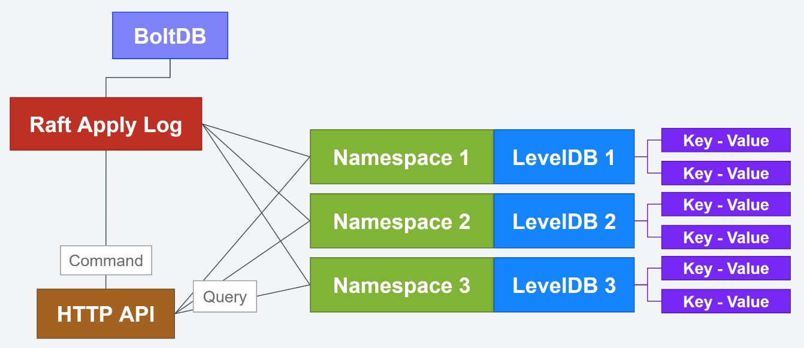

# FraiseDB
## 基于Hashicorp Raft + LevelDB的分布式键值型数据库
### 在写

***

## 功能
* 键值写入/读取
* 名称空间隔离数据
* 支持设置键值过期时间
* 节点间数据保持强一致性
* HTTP对外服务
* WS订阅监听某个/某批前缀相同的键值更新事件



***

## 使用方式
* `1` 启动集群中的第一个节点时（或者单节点部署时），config.yaml中的node.first设为true，第一个节点默认为主节点
* `2` 启动集群中的第二、第三...乃至后续节点时，config.yaml中的node.first设为false
* `3` 在主节点（第一个启动的节点）上调用`新建节点`接口，将后续启动的节点依此加入到第一个节点所在的集群中
#### `注` 如果在从节点上执行名称空间变更或键值变更相关操作，该操作会自动转发到主节点执行

***

## HTTP接口文档

***

### node 集群节点相关

***

> `POST` http://127.0.0.1:8000/v2/node 新建节点（必须在主节点上执行）
#### 请求
Body
```json
{
  "addr": "127.0.0.1",
  "httpPort": 7000,
  "tcpPort": 6999
}
```
#### 响应
```json
{
  "ok": true,
  "data": "127.0.0.1:7000",
  "error": ""
}
```

***

> `DELETE` http://127.0.0.1:8000/v2/node/{endpoint} 删除节点（必须在主节点上执行）
#### 请求
URI
```
endpoint = 127.0.0.1:7000
```
#### 响应
```json
{
  "ok": true,
  "data": null,
  "error": ""
}
``` 

***

> `GET` http://127.0.0.1:8000/v2/nodes 获取节点列表
#### 响应
```json
{
  "ok": true,
  "data": [
    {
      "endpoint": "127.0.0.1:8000",
      "health": true,
      "leader": true
    },
    {
      "endpoint": "127.0.0.1:7000",
      "health": true,
      "leader": false
    }
  ],
  "error": ""
}
```

***

> `GET` http://127.0.0.1:8000/v2/leader 获取主节点
#### 响应
```json
{
  "ok": true,
  "data": "127.0.0.1:8000",
  "error": ""
}
```

***

> `GET` http://127.0.0.1:8000/v2/config 获取当前节点配置（内部调用）
#### 响应
```json
{
  "node": {
    "first": true,
    "addr": "127.0.0.1",
    "tcpPort": 7999,
    "httpPort": 8000
  },
  "store": {
    "data": "./data",
    "log": "./log"
  }
}
```

***

> `GET` http://127.0.0.1:8000/v2/health 获取当前节点健康状态（内部调用）
#### 响应
```
1
```

***

### namespace 名称空间相关

***

> `POST` http://127.0.0.1:8000/v2/namespace/{namespace} 新建名称空间
#### 请求
URI
```
namespace = dev
```
#### 响应
```json
{
  "ok": true,
  "data": null,
  "error": ""
}
``` 

***

> `DELETE` http://127.0.0.1:8000/v2/namespace/{namespace} 删除名称空间
#### 请求
URI
```
namespace = dev
```
#### 响应
```json
{
  "ok": true,
  "data": null,
  "error": ""
}
``` 

***

> `GET` http://127.0.0.1:8000/v2/namespaces 获取名称空间列表
#### 响应
```json
{
  "ok": true,
  "data": [
    "default",
    "dev"
  ],
  "error": ""
}
``` 
### kv 键值相关

***

> `PUT` http://127.0.0.1:8000/v2/kv/{namespace}/{key} 更新键值
#### 请求
URI
```
namespace = dev
key = test
```
Body
```json
{
    "value": "hello world",
    "ttl": 300
}
```
#### 响应
```json
{
  "ok": true,
  "data": 1690475805,
  "error": ""
}
``` 

***

> `DELETE` http://127.0.0.1:8000/v2/kv/{namespace}/{key} 删除键值
#### 请求
URI
```
namespace = dev
key = test
```
#### 响应
```json
{
  "ok": true,
  "data": null,
  "error": ""
}
``` 

***

> `GET` http://127.0.0.1:8000/v2/kv/{namespace}/{key} 根据键获取键值
#### 请求
URI
```
namespace = dev
key = test
```
#### 响应
```json
{
  "ok": true,
  "data": {
    "value": "hello world1",
    "ddl": 1690475805
  },
  "error": ""
}
``` 

***

> `GET` http://127.0.0.1:8000/v2/kvs/{namespace}/{key_prefix}?limit=10 根据键前缀获取键值列表
#### 请求
URI
```
namespace = dev
key_prefix = te
```
Query
```
limit = 10
```
#### 响应
```json
{
  "ok": true,
  "data": {
    "test": {
      "value": "hello world1",
      "ddl": 1690475805
    },
    "test1": {
      "value": "hi world",
      "ddl": 0
    }
  },
  "error": ""
}
```

***

### subscribe 订阅监听相关

***

> `WS` http://127.0.0.1:8000/subscribe/{namespace}/{key_prefix}/{client_id} 订阅监听某个/某批前缀相同的键值更新事件
#### 请求
URI
```
namespace = dev
key_prefix = te
clientId = 12he6fj48dhe36fu398rhf3hf392423g
```
#### 推送消息样式
```json
{
  "method": 1,
  "key": "test",
  "value": "hello world",
  "ddl": 1690475805
}
```